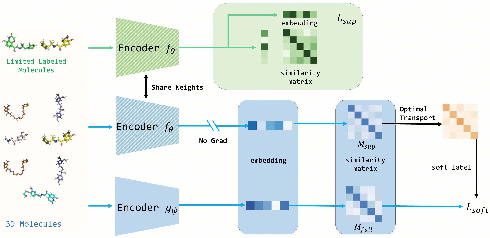

# S-MolSearch: 3D Semi-supervised Contrastive Learning for Bioactive Molecule Search

[[Paper](https://openreview.net/pdf?id=wJAF8TGVUG)], [[Bohrium App](https://bohrium.dp.tech/apps/s-molsearch)]

This repository contains the official implementation of S-MolSearch, a novel semi-supervised contrastive learning framework for molecular search, as presented in our NeurIPS 2024 paper.

<p align="center"></p>
<p align="center"><b>Overview of the S-MolSearch framework</b></p>

 S-MolSearch leverages inverse optimal transport to integrate limited labeled data with extensive unlabeled data, significantly enhancing the accuracy and efficiency of molecule searches in virtual screening.


## Release
The main code has been released. Training and testing scripts will be released ASAP.

## Citation
If you find this work useful, please cite our paper:
```bibtex
@inproceedings{
zhou2024smolsearch,
title={S-MolSearch: 3D Semi-supervised Contrastive Learning for Bioactive Molecule Search},
author={Gengmo Zhou and Zhen Wang and Feng Yu and Guolin Ke and Zhewei Wei and Zhifeng Gao},
booktitle={The Thirty-eighth Annual Conference on Neural Information Processing Systems},
year={2024},
url={https://openreview.net/forum?id=wJAF8TGVUG}
}
```

